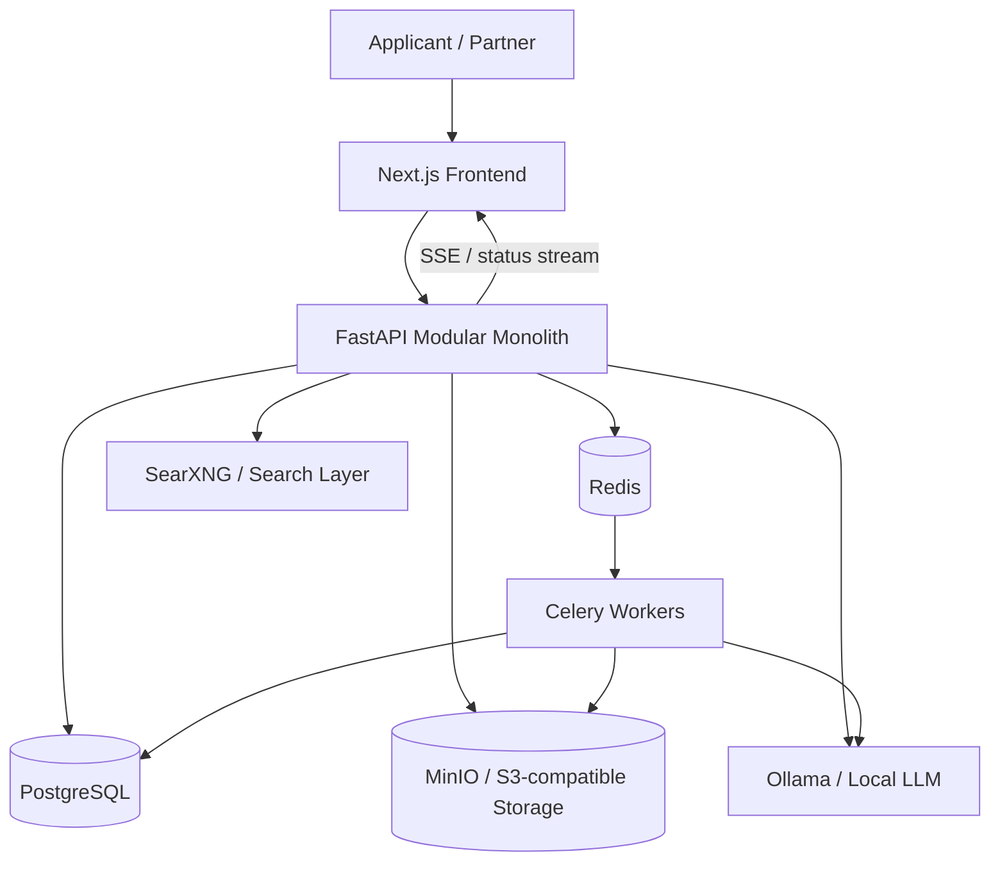
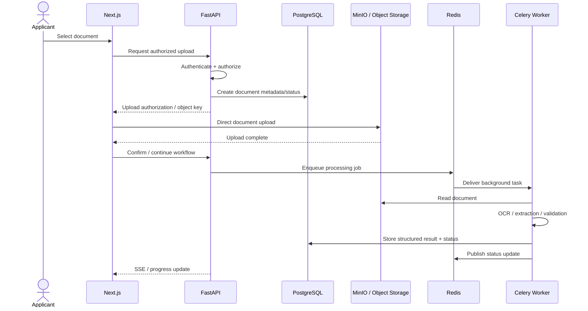
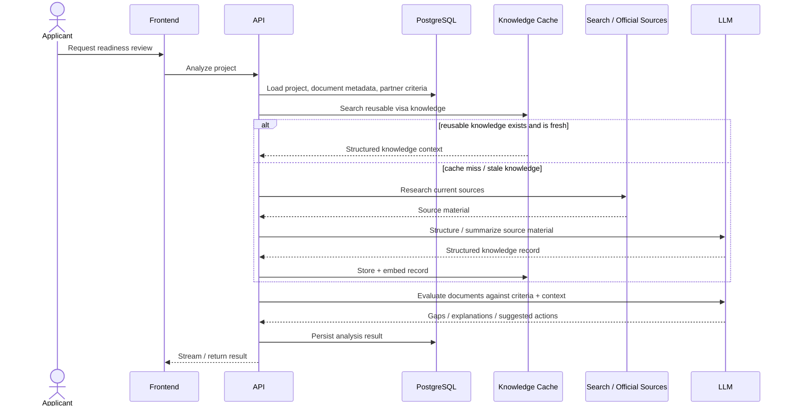
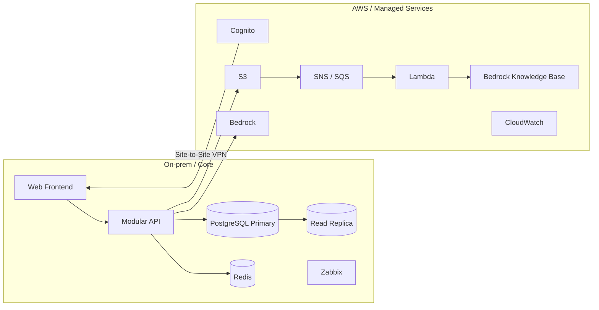

# System Architecture

This document presents the architecture as a portfolio case study and separates the **localized MVP demonstrated by the team** from the **hybrid/cloud reference architecture** described in the original architecture documentation.

## 1. Localized MVP boundary



The final presentation frames the prototype as a localized / air-gapped stack so the core experience could run without requiring the future cloud environment.

### Responsibilities

| Component | Responsibility |
|---|---|
| Next.js | applicant/partner UI, chat, upload workflow, readiness results |
| FastAPI | synchronous API surface, business orchestration, access checks, status endpoints |
| PostgreSQL | relational state: users/projects/plugins/document metadata/results |
| Redis | cache, broker/pub-sub behavior, rate-limit state |
| Celery | asynchronous OCR/extraction/digitization/AI jobs |
| MinIO | raw document/object storage using an S3-compatible interface |
| Ollama | localized LLM inference for prototype AI workflows |
| SearXNG | localized web-search integration for newly researched visa rules |
| Vector cache | semantic retrieval of previously structured knowledge records |

## 2. Logical domains

The system is easier to reason about as a modular monolith with domain boundaries rather than a collection of unrelated endpoints.

```text
application/
├── identity/        # authentication context, roles, user/partner identity
├── projects/        # visa-readiness workspace and intent
├── documents/       # metadata, upload state, document lifecycle
├── plugins/         # partner criteria, checklists, visa-specific knowledge
├── analysis/        # readiness scoring, extraction, gap analysis
├── knowledge/       # source research, semantic cache, retrieval
├── chat/            # contextual Q&A and streaming responses
└── admin/           # governance and partner/plugin approval
```

The exact source-tree names in the original implementation may differ. The structure above is a **logical architecture view**, not a claim that the repository used these exact folder names.

## 3. Document-processing flow



The final presentation specifically highlights a presigned/direct-upload style flow to keep large files away from the API data path and to separate storage from compute.

## 4. Readiness-analysis flow



## 5. Event-driven decoupling

Long-running tasks are moved away from the request/response path. The architecture benefits are:

- lower user-facing latency;
- independent worker scaling;
- explicit retries;
- queue backlog visibility;
- better fault isolation;
- a path toward DLQs and durable managed messaging later.

The key production requirement is **idempotency**: a retried document-processing job should not create duplicate analysis records or corrupt document state.

## 6. Target hybrid/cloud architecture

The original team architecture README describes a broader **on-premise + AWS** design:



That reference architecture is valuable for discussing scale, managed identity, durable object storage, event-driven processing, and RAG infrastructure. It is **not presented here as fully deployed prototype infrastructure**.

## 7. Architecture discrepancy preserved intentionally

The current README in the original team repository uses **Flask** in its hybrid architecture example. The final prototype presentation identifies **FastAPI** as the localized MVP backend.

This portfolio treats them as different artifacts:

- final prototype evidence → FastAPI;
- current architecture document → Flask reference implementation language;
- product/domain architecture → framework-independent.

A senior reviewer should not have to guess which one actually ran in the prototype.

## 8. Data ownership

A production implementation should keep the following separation:

- **PostgreSQL:** metadata, relationships, roles, project state, processing status, analysis results;
- **Object storage:** raw uploaded documents;
- **Redis:** ephemeral cache/queue/rate-limit/pub-sub state;
- **Vector store:** derived embeddings and structured knowledge references;
- **LLM context:** minimum necessary excerpts, not uncontrolled copies of all applicant data.

See [SECURITY_PRIVACY.md](./SECURITY_PRIVACY.md) for the security implications.
