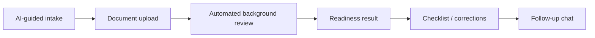
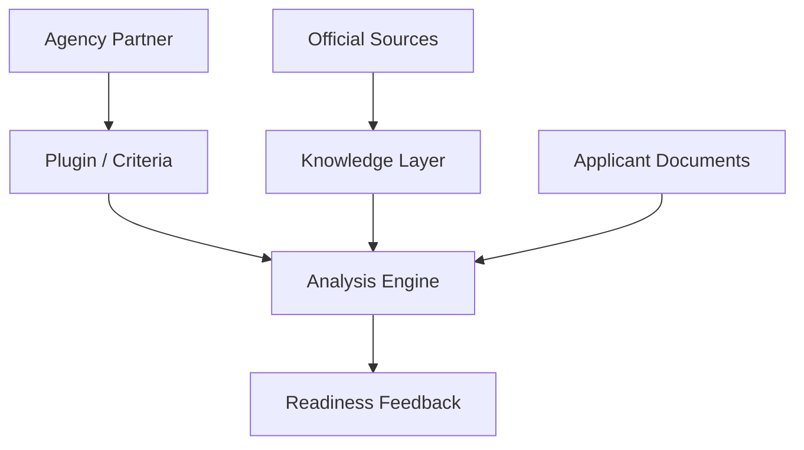

# Localized MVP

This document records what the **final prototype presentation** describes as the localized, air-gapped MVP. It intentionally avoids presenting future AWS components as already deployed.

## Goal

Demonstrate the end-to-end applicant experience on a controllable environment:

1. guided visa-intent intake;
2. document upload;
3. asynchronous document review;
4. structured readiness feedback;
5. contextual AI assistance;
6. reusable visa knowledge for repeated questions.

## Prototype stack

| Layer | Prototype technology | Why it fits the MVP |
|---|---|---|
| Web UI | Next.js | modern web experience and clear frontend/backend boundary |
| API | FastAPI | Python ecosystem, typed request models, async-friendly API surface |
| Relational data | PostgreSQL | durable transactional metadata and application state |
| Cache / broker | Redis | low-latency state, pub/sub, queue/broker integration |
| Background jobs | Celery | isolates OCR/extraction/AI work from synchronous requests |
| Object storage | MinIO | local S3-compatible storage for uploaded files |
| Local LLM | Ollama | allows local inference without a managed cloud model dependency |
| Web search | SearXNG | local search layer for newly researched rule information |
| Vector retrieval | ChromaDB / pgvector-style semantic cache concept | reuse previously structured knowledge |
| Packaging | Docker / Docker Compose | reproducible multi-service deployment on a single VPS |

The final presentation describes the prototype as running in **11+ localized containers**. The exact service count may change as containers are split or consolidated, so this portfolio focuses on the architectural responsibilities rather than treating the number as a fixed production requirement.

## User workflow

### Step 1 - guided intake

The assistant captures structured context such as:

- destination country;
- visa type;
- nationality;
- applicant intent;
- relevant application scenario.

The important engineering detail is that conversational input should become **structured state**, not remain only as chat history.

### Step 2 - document upload

The applicant adds supporting documents. The architecture separates:

- document metadata and status in PostgreSQL;
- raw files in object storage;
- processing jobs in the asynchronous worker layer.

### Step 3 - automated review

Background work can include:

- OCR / text extraction;
- document classification;
- missing-field or format checks;
- conversion into structured fields;
- comparison against plugin/checklist criteria;
- readiness analysis support.

### Step 4 - readiness output

The prototype presentation shows a readiness score and actionable guidance. In production, a numeric score should always be paired with:

- the criteria used;
- what evidence was observed;
- what is missing;
- source freshness;
- uncertainty / confidence;
- a disclaimer that approval belongs to official authorities.

## Partner plugin concept

A distinctive product concept is the **partner plugin**: verified agencies or partners can encode visa-specific knowledge, required-document checklists, and scoring criteria.

This creates a layer between generic AI advice and a rigid hard-coded checklist:

The partner layer requires governance. A production platform should support draft/review/publish/suspend states and maintain audit history for criteria changes.

## What is not claimed as implemented

The MVP documentation does **not** prove that the following enterprise architecture was fully deployed:

- AWS Cognito;
- Amazon Bedrock;
- Bedrock Knowledge Base;
- SNS/SQS/Lambda processing;
- multi-AZ PostgreSQL;
- production-grade Redis HA;
- global CDN;
- complete DR/failover automation.

Those elements appear as architecture / roadmap material and are documented separately in [docs/DEPLOYMENT_ROADMAP.md](./docs/DEPLOYMENT_ROADMAP.md).

## Prototype evidence

The original team repository includes dedicated MVP screenshots, while the final presentation includes visual evidence of the prototype flow and container architecture. Links are collected in [SOURCE_EVIDENCE.md](./SOURCE_EVIDENCE.md).
