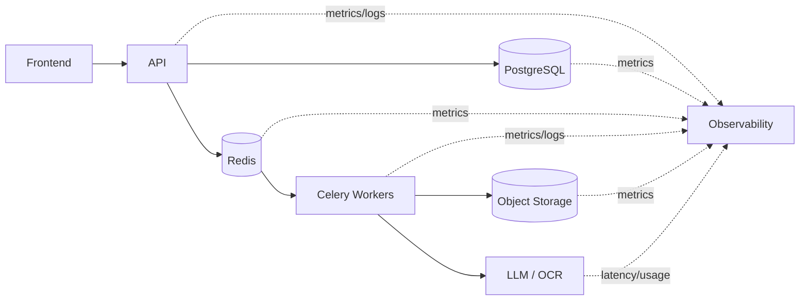

# Observability & Operations

The final project presentation includes an operations view spanning infrastructure health, queue/cache health, automated knowledge invalidation, and rate limiting. This document turns that into a practical monitoring model.

## 1. What to observe



## 2. Golden signals by layer

### API

- request rate;
- p50 / p95 / p99 latency;
- HTTP error rate;
- active requests;
- dependency timeout rate;
- rate-limit rejection count.

### PostgreSQL

- connection-pool usage;
- slow query count;
- query latency;
- lock contention / deadlocks;
- transaction errors;
- replication lag when a replica exists;
- disk capacity.

### Redis

- memory usage;
- evictions;
- command latency;
- connection count;
- pub/sub or broker health;
- cache hit ratio;
- rate-limit key growth.

### Celery / workers

- queue depth;
- oldest task age;
- tasks started/completed/failed;
- retry rate;
- worker concurrency/utilization;
- task duration by workload type;
- DLQ/permanent-failure count in a future durable-queue design.

### Object storage

- upload/download error rate;
- latency;
- storage growth;
- failed object reads;
- lifecycle/deletion failures.

### AI / retrieval

- model latency;
- token/compute usage where relevant;
- timeout rate;
- structured-output validation failures;
- retrieval hit/miss ratio;
- cache hit ratio;
- stale-knowledge detections;
- citations/source-provenance coverage.

## 3. User-facing SLO candidates

Examples of measurable service objectives:

| User journey | Candidate signal |
|---|---|
| open dashboard | p95 API latency |
| upload document | successful authorization + object upload rate |
| submit document review | enqueue success rate |
| wait for analysis | p95 job completion time |
| readiness result | result-generation success rate |
| chat | time-to-first-token / response completion rate |

Exact SLO targets were not established in the supplied project materials, so this portfolio does not invent numerical targets.

## 4. Correlation IDs

A distributed workflow becomes difficult to debug if API requests, queue jobs, and worker logs cannot be connected.

Recommended trace context:

```text
request_id
user_id (opaque/internal)
project_id
document_id
job_id
trace_id
```

Every worker job should preserve the parent correlation context without logging the sensitive document body.

## 5. Structured logging

Example event shape:

```json
{
  "event": "document_processing_completed",
  "document_id": "doc_123",
  "project_id": "project_456",
  "job_id": "job_789",
  "duration_ms": 4812,
  "status": "ready"
}
```

PII and raw document text should be excluded.

## 6. Cache freshness monitoring

The presentation includes automated cache invalidation as an operations concern. Useful metrics:

- active knowledge records;
- stale records;
- refresh attempts;
- refresh failures;
- average source age;
- cache hit rate by country/visa type;
- source changes detected.

## 7. Alerting examples

High-signal alerts could include:

- API error rate above threshold;
- queue oldest-job age growing continuously;
- worker pool unavailable;
- database connection pool saturated;
- replication lag beyond acceptable range;
- object storage upload failures;
- AI provider timeout spike;
- document jobs repeatedly retrying;
- stale official-source records served beyond policy;
- unusual access to critical document classes.

## 8. Local vs cloud monitoring

The team architecture materials discuss:

- **Zabbix** for on-prem/infrastructure health;
- **CloudWatch** for future AWS-managed components.

The localized MVP does not imply that every cloud monitoring component was deployed. The important architectural principle is that metrics/logs should follow each workload as deployment evolves.

## 9. Operational runbook questions

A production owner should be able to answer:

- How do we identify a stuck document job?
- How do we retry without duplicating results?
- How do we inspect queue backlog?
- How do we distinguish model failure from document parsing failure?
- How do we invalidate a wrong visa-rule record?
- How do we revoke access to a leaked document URL?
- How do we delete all derived data for one applicant?
- How do we fail over database reads/writes?

Observability is useful only when it supports those operational decisions.
