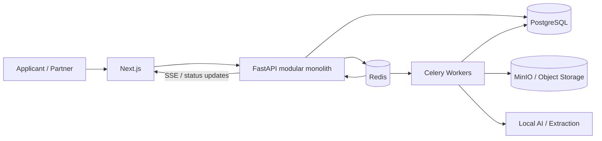
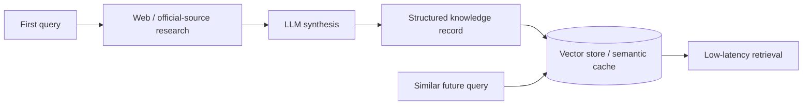

# Go4beyond AI Visa Platform

**Go4beyond** is a collaborative AI-assisted visa-readiness platform developed for the **APIE Advanced Camp Japan**. The prototype explores how fragmented visa requirements, document-quality checks, and partner knowledge can be turned into a structured workflow: guided intake, document upload, automated review, readiness scoring, and actionable corrections.

> **Portfolio note:** this repository is a curated personal portfolio mirror of a **team project**. I served as **Group Lead / Ketua Kelompok**. The original implementation, architecture work, test fixtures, and prototype evidence remain linked in [SOURCE_EVIDENCE.md](./SOURCE_EVIDENCE.md). This repository does not claim that every original module was authored by me individually.

## Why this project is interesting

This project goes beyond an LLM chatbot. The engineering problem is to coordinate **documents, asynchronous processing, retrieval, caching, partner rules, real-time status updates, privacy controls, and an AI reasoning layer** without blocking the user-facing request path.

The prototype demonstrates a local, containerized architecture; the design work then shows how the same product could evolve toward high availability and a managed cloud deployment.

## Product flow

The final prototype presentation describes a four-stage user journey:

1. **AI-guided chat** to capture destination, visa type, nationality, and intent.
2. **Document upload** into the applicant workspace.
3. **Automated review** for missing data, formatting issues, and readiness criteria.
4. **Readiness score** with an actionable checklist before submission.

The platform is positioned as **decision support and readiness guidance**, not as a visa authority and not as a guarantee of approval.

## Current MVP vs target architecture

A key design decision in this portfolio is to separate **what the team demonstrated in the localized MVP** from **what was proposed for future scale**.

| Area | Localized MVP / prototype | Scale / enterprise direction |
|---|---|---|
| Frontend | Next.js | Next.js behind production reverse proxy / load balancer |
| API | FastAPI modular monolith | Stateless horizontally scalable API nodes |
| Database | PostgreSQL | Primary + read replica / HA strategy |
| Cache & messaging | Redis | Redis HA / managed equivalent |
| Background processing | Celery workers | Resilient queues, retries, DLQ-oriented processing |
| Object storage | MinIO / S3-compatible | Amazon S3 |
| Local LLM | Ollama | Managed model platform such as Amazon Bedrock |
| Search / retrieval | SearXNG + vector cache | Managed retrieval / knowledge-base services |
| Monitoring | local / infrastructure monitoring concepts | Zabbix + cloud monitoring / alerting |
| Deployment | Docker Compose on a single VPS | multi-instance HA, then cloud-native managed services |

This distinction matters because the original project materials contain both **implemented prototype components** and **future-state AWS architecture**.

## Localized MVP architecture

The final prototype used a local/air-gapped approach so that the end-to-end workflow could be demonstrated without depending on a full cloud environment. The presentation identifies:

- **Next.js** for the frontend;
- **FastAPI** for the backend;
- **PostgreSQL** for relational state;
- **Redis** for cache / broker behavior;
- **Celery** for background document processing;
- **MinIO** for S3-compatible object storage;
- **Ollama** for local LLM inference;
- **SearXNG** for local web-search integration;
- containerized deployment through **Docker**.

See [MVP.md](./MVP.md) and [ARCHITECTURE.md](./ARCHITECTURE.md).

## Event-driven processing

Long-running OCR, AI extraction, document digitization, and similar jobs should not block synchronous API requests. The prototype architecture therefore separates the request path from background work:

The same design gives a natural migration path toward managed queues and worker fleets later.

## Knowledge-cache flywheel

The project also explores reducing repeated search and LLM cost by turning verified visa-rule research into reusable structured knowledge.

The final presentation frames this as: **research once, structure it, embed it, and reuse it for semantically similar future requests**. See [docs/KNOWLEDGE_CACHE.md](./docs/KNOWLEDGE_CACHE.md).

## Secure document lifecycle

Visa workflows can involve passports, identity records, bank statements, pay slips, invitation letters, and other sensitive files. The architecture therefore treats document handling as a separate security problem:

- authenticated and authorized upload requests;
- time-limited upload authorization / presigned-object workflow;
- direct upload to object storage where appropriate;
- encryption in transit and at rest;
- metadata separated from raw document files;
- ephemeral worker processing where possible;
- role-based access and administrative governance;
- explicit retention, deletion, and privacy requirements.

See [SECURITY_PRIVACY.md](./SECURITY_PRIVACY.md).

## Architecture evolution

The team's roadmap separated deployment into three stages:

1. **Prototype** - Docker Compose on a single VPS with localized dependencies.
2. **Scale & HA** - reverse proxy/load balancing, multiple API instances, Redis resilience, database read replica / failover planning.
3. **Enterprise cloud-native** - managed identity, durable object storage, managed queues, managed AI/RAG services, multi-AZ data services, and global delivery.

The roadmap is a design direction, not a claim that every enterprise component was deployed during the prototype. See [docs/DEPLOYMENT_ROADMAP.md](./docs/DEPLOYMENT_ROADMAP.md).

## Service ecosystem

Go4beyond models more than a direct applicant-to-AI interaction. The product coordinates:

- **Applicants** - intent, documents, readiness feedback;
- **Agency partners** - country/visa-specific workflow knowledge and plugin criteria;
- **Admins** - governance, approval, publishing, and suspension;
- **Official sources** - government and embassy requirements;
- **AI / retrieval infrastructure** - extraction, retrieval, scoring assistance, and conversational guidance.

See [docs/SERVICE_ECOSYSTEM.md](./docs/SERVICE_ECOSYSTEM.md).

## Architecture documentation

A reviewer can navigate directly to the technical areas below:

| Area | Document |
|---|---|
| Current prototype boundary | [MVP.md](./MVP.md) |
| System architecture & data flow | [ARCHITECTURE.md](./ARCHITECTURE.md) |
| Event-driven design & resilience | [SCALABILITY_RESILIENCE.md](./SCALABILITY_RESILIENCE.md) |
| Security, PII & document lifecycle | [SECURITY_PRIVACY.md](./SECURITY_PRIVACY.md) |
| Observability & operations | [OBSERVABILITY.md](./OBSERVABILITY.md) |
| Knowledge cache / retrieval | [docs/KNOWLEDGE_CACHE.md](./docs/KNOWLEDGE_CACHE.md) |
| Service ecosystem | [docs/SERVICE_ECOSYSTEM.md](./docs/SERVICE_ECOSYSTEM.md) |
| Deployment evolution | [docs/DEPLOYMENT_ROADMAP.md](./docs/DEPLOYMENT_ROADMAP.md) |
| Original team evidence | [SOURCE_EVIDENCE.md](./SOURCE_EVIDENCE.md) |
| Team attribution | [TEAM_ATTRIBUTION.md](./TEAM_ATTRIBUTION.md) |
| Limitations / non-claims | [LIMITATIONS.md](./LIMITATIONS.md) |
| Recruiter / CV summary | [PORTFOLIO.md](./PORTFOLIO.md) |

## Important architecture-source distinction

The current architecture README in the original team repository describes a **hybrid on-prem + AWS reference design** and uses a Flask modular-monolith example, while the final prototype presentation describes the **localized MVP backend as FastAPI**. This portfolio preserves that distinction instead of silently merging the two designs:

- **FastAPI** = final localized prototype presentation;
- **Flask + AWS hybrid description** = architecture/reference-design material in the team's current README;
- **historical implementation snapshot** = linked separately for source-level traceability.

That difference is documented further in [LIMITATIONS.md](./LIMITATIONS.md).

## My role

**Role: Group Lead / Ketua Kelompok**

I coordinated the group project and its final technical narrative across product flow, architecture, prototype evidence, system trade-offs, and presentation. Because the project was collaborative, this repository intentionally separates **team-level implementation** from **individual ownership claims**. For verification and original artifacts, see [TEAM_ATTRIBUTION.md](./TEAM_ATTRIBUTION.md) and [SOURCE_EVIDENCE.md](./SOURCE_EVIDENCE.md).

## Ethical / product disclaimer

Go4beyond is a prototype decision-support system. Visa requirements can change and final decisions belong to the relevant government/consular authority. AI-generated readiness scores, extracted document data, and synthesized requirements require source traceability, freshness controls, and human review before production use.

---

**Portfolio owner:** [Syifani Adillah Salsabila](https://github.com/syifaniads)  
**Role:** Group Lead / Ketua Kelompok  
**Project:** APIE Advanced Camp Japan - Group 6  
**Type:** Collaborative AI platform / backend architecture / distributed workflow prototype
