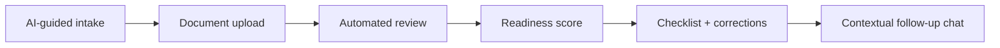
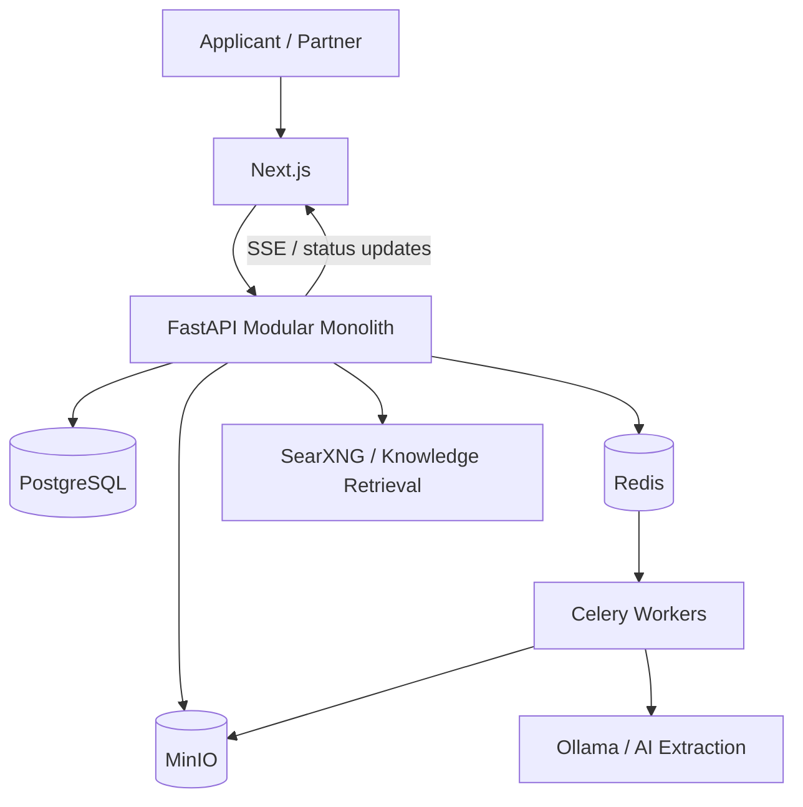
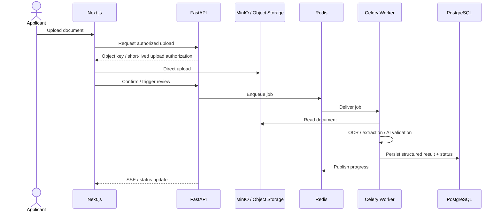
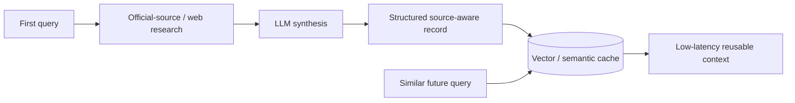
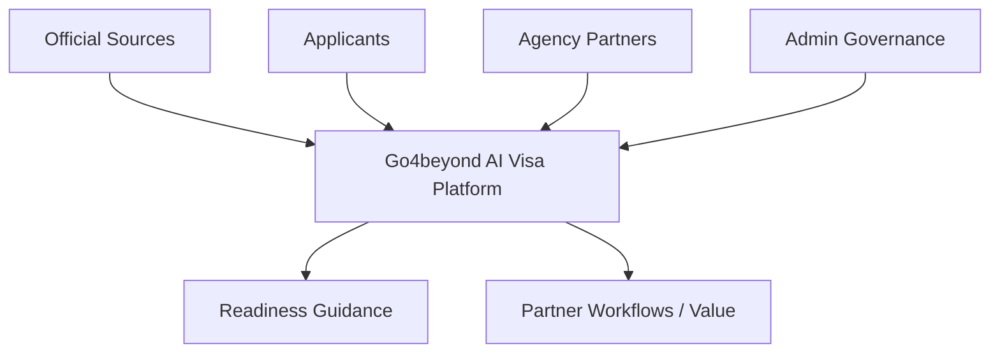
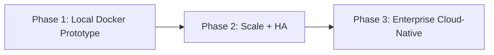

# Go4beyond AI Visa Platform

**Go4beyond** is a collaborative AI-assisted visa-readiness platform developed for the **APIE Advanced Camp Japan**. The prototype explores how fragmented visa requirements, document-quality checks, and partner knowledge can be turned into a structured workflow: guided intake, document upload, automated review, readiness scoring, and actionable corrections.

> **Portfolio note:** this repository is a curated personal portfolio mirror of a **team project**. I served as **Group Lead / Ketua Kelompok**. The original implementation, architecture work, test fixtures, and prototype evidence remain linked in [SOURCE_EVIDENCE.md](./SOURCE_EVIDENCE.md). This repository does not claim that every original module was authored by me individually.

## Why this project is interesting

This project goes beyond an LLM chatbot. The engineering problem is to coordinate **documents, asynchronous processing, retrieval, caching, partner rules, real-time status updates, privacy controls, and an AI reasoning layer** without blocking the user-facing request path.

The prototype demonstrates a localized containerized architecture; the design work then shows how the same product could evolve toward high availability and managed cloud infrastructure.

## User journey

The final prototype presentation describes four primary stages: **AI-guided chat → document upload → automated review → readiness score**. The platform is decision support, not a visa authority and not a guarantee of approval.

## Current MVP vs target architecture

A key portfolio decision is to separate **what the team demonstrated in the localized MVP** from **what was proposed for future scale**.

| Area | Localized MVP / prototype | Scale / enterprise direction |
|---|---|---|
| Frontend | Next.js | Next.js behind production reverse proxy / load balancer |
| API | FastAPI modular monolith | Stateless horizontally scalable API nodes |
| Database | PostgreSQL | Primary + read replica / HA strategy |
| Cache & messaging | Redis | Redis HA / managed equivalent |
| Background processing | Celery workers | resilient queues, retries, DLQ-oriented processing |
| Object storage | MinIO / S3-compatible | Amazon S3 |
| Local LLM | Ollama | managed model platform such as Amazon Bedrock |
| Search / retrieval | SearXNG + vector cache | managed retrieval / knowledge-base services |
| Monitoring | local/infrastructure monitoring concepts | Zabbix + cloud monitoring / alerting |
| Deployment | Docker Compose on a single VPS | multi-instance HA, then cloud-native managed services |

See [MVP.md](./MVP.md) and [docs/DEPLOYMENT_ROADMAP.md](./docs/DEPLOYMENT_ROADMAP.md).

## Localized MVP architecture

The final presentation identifies **Next.js, FastAPI, PostgreSQL, Redis, Celery, MinIO, Ollama, SearXNG, and Docker** as core localized-prototype components. The deck frames the prototype as running across 11+ localized containers.

## Event-driven document processing

Long-running OCR, AI extraction, digitization, and similar work should not block synchronous requests.

See [ARCHITECTURE.md](./ARCHITECTURE.md) and [SCALABILITY_RESILIENCE.md](./SCALABILITY_RESILIENCE.md).

## Knowledge-cache flywheel

The team presentation proposes turning expensive first-time research into reusable structured knowledge. A production implementation still needs source provenance, freshness checks, and cache invalidation. See [docs/KNOWLEDGE_CACHE.md](./docs/KNOWLEDGE_CACHE.md).

## Security & privacy

Visa workflows can involve passports, national IDs, bank statements, pay slips, invitation letters, and other sensitive files. The project architecture therefore discusses:

- authenticated and authorized upload requests;
- time-limited/presigned object upload patterns;
- direct object-storage upload where appropriate;
- encryption in transit and at rest;
- metadata separated from raw files;
- role-based access and administrative governance;
- data retention/deletion requirements;
- minimum-necessary AI context;
- source-aware visa-rule retrieval.

See [SECURITY_PRIVACY.md](./SECURITY_PRIVACY.md).

## Service ecosystem

Agency partners can encode country/visa-specific checklists and workflow knowledge through the plugin concept, while admins govern approval/publishing and official sources provide the grounding layer. See [docs/SERVICE_ECOSYSTEM.md](./docs/SERVICE_ECOSYSTEM.md).

## Architecture evolution

The roadmap moves from a single-VPS prototype toward load-balanced APIs, resilient queues/caches, database replica/failover patterns, durable object storage, and eventually managed identity, storage, queue, AI/RAG, database, and monitoring services. These later components are **design direction**, not claims that the complete enterprise architecture was deployed.

## Reviewer navigation

| Area | Document |
|---|---|
| Recruiter / CV summary | [PORTFOLIO.md](./PORTFOLIO.md) |
| Current prototype boundary | [MVP.md](./MVP.md) |
| Architecture & data flows | [ARCHITECTURE.md](./ARCHITECTURE.md) |
| Scalability, retries, idempotency | [SCALABILITY_RESILIENCE.md](./SCALABILITY_RESILIENCE.md) |
| Security, PII, document lifecycle | [SECURITY_PRIVACY.md](./SECURITY_PRIVACY.md) |
| Observability & operations | [OBSERVABILITY.md](./OBSERVABILITY.md) |
| Knowledge cache / retrieval | [docs/KNOWLEDGE_CACHE.md](./docs/KNOWLEDGE_CACHE.md) |
| Service ecosystem | [docs/SERVICE_ECOSYSTEM.md](./docs/SERVICE_ECOSYSTEM.md) |
| Deployment roadmap | [docs/DEPLOYMENT_ROADMAP.md](./docs/DEPLOYMENT_ROADMAP.md) |
| Final presentation evidence notes | [docs/presentation/FINAL_PRESENTATION_NOTES.md](./docs/presentation/FINAL_PRESENTATION_NOTES.md) |
| Original team evidence | [SOURCE_EVIDENCE.md](./SOURCE_EVIDENCE.md) |
| Team attribution | [TEAM_ATTRIBUTION.md](./TEAM_ATTRIBUTION.md) |
| Limitations / non-claims | [LIMITATIONS.md](./LIMITATIONS.md) |

## Important source distinction

The current architecture README in the original team repository describes a **hybrid on-prem + AWS reference design** and uses a **Flask** modular-monolith example, while the final prototype presentation describes the localized MVP backend as **FastAPI**.

This portfolio preserves that difference:

- **FastAPI** = final localized prototype evidence;
- **Flask + AWS hybrid** = architecture/reference-design material in the current team README;
- **historical implementation snapshot** = linked separately for source-level traceability.

See [LIMITATIONS.md](./LIMITATIONS.md).

## My role

**Group Lead / Ketua Kelompok**

I coordinated the group project and its final technical narrative across product scope, architecture, prototype evidence, system trade-offs, and presentation. Because the work was collaborative, this repository separates **team-level implementation** from **individual ownership claims**. See [TEAM_ATTRIBUTION.md](./TEAM_ATTRIBUTION.md).

## Evidence

The portfolio links directly to:

- the original team repository;
- the historical implementation snapshot;
- prepared document fixtures;
- the original MVP screenshot directory;
- a page-by-page record of the final technical presentation.

See [SOURCE_EVIDENCE.md](./SOURCE_EVIDENCE.md).

## Product disclaimer

Go4beyond is a prototype decision-support system. Visa requirements can change and final decisions belong to the relevant government/consular authority. AI-generated readiness scores, extracted document data, and synthesized requirements require source traceability, freshness controls, and human review before production use.

---

**Portfolio owner:** [Syifani Adillah Salsabila](https://github.com/syifaniads)  
**Role:** Group Lead / Ketua Kelompok  
**Project:** APIE Advanced Camp Japan - Group 6  
**Type:** Collaborative AI platform · backend architecture · distributed workflow prototype
