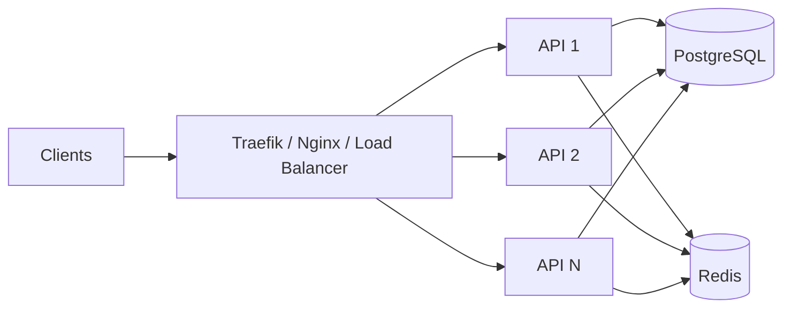
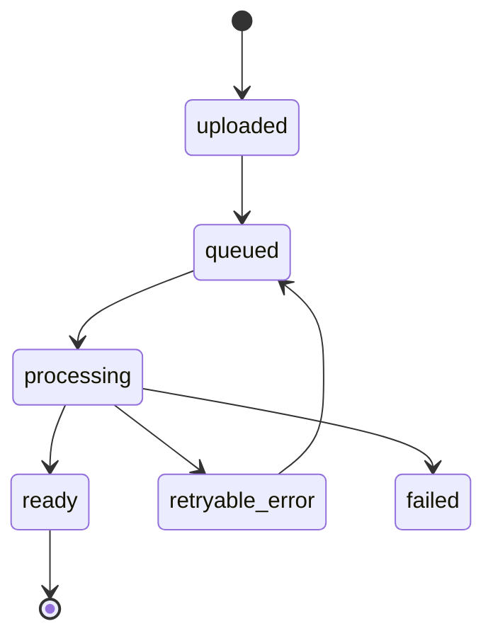

# Scalability & Resilience

The prototype starts intentionally simple: one localized Docker environment, a modular API, PostgreSQL, Redis, object storage, and background workers. The interesting engineering question is **how to scale each bottleneck without prematurely turning the MVP into a distributed-systems project**.

## 1. Primary bottlenecks

| Bottleneck | Failure mode | Scaling direction |
|---|---|---|
| synchronous API | slow requests / saturation | stateless API instances behind reverse proxy/load balancer |
| AI / OCR jobs | long latency, CPU/GPU pressure | Celery worker scaling by queue/workload type |
| Redis | queue/cache single point of failure | persistence/HA or managed Redis; separate critical queue semantics where needed |
| PostgreSQL | read contention / connection pressure | pooling, indexes, read replica, then HA/failover |
| object storage | disk loss / capacity | replicated S3-compatible storage or managed S3 |
| fresh visa research | expensive and repetitive | source-aware knowledge cache + freshness policy |
| LLM calls | cost/rate limits/latency | cache, rate limits, provider abstraction, async work |

## 2. API scaling

The API should remain as stateless as practical. Durable state belongs in PostgreSQL/object storage; ephemeral coordination belongs in Redis.



Horizontal API scaling is useful only when downstream resources can handle the additional concurrency. Database connection pools, Redis limits, object-storage throughput, and LLM quotas must be budgeted together.

## 3. Background-worker scaling

A queue separates arrival rate from processing rate.

Useful worker pools could eventually be split by workload:

```text
queue: document-ocr
queue: document-extraction
queue: readiness-analysis
queue: knowledge-refresh
queue: notifications
```

This prevents an expensive LLM backlog from starving lightweight document-status work.

### Queue metrics that matter

- queue depth;
- oldest-job age;
- processing latency;
- retry rate;
- permanent-failure / DLQ count;
- worker utilization;
- task success rate.

## 4. Idempotency

Retries are expected in asynchronous systems. Therefore workers should be safe to run more than once.

Example document state machine:



Recommended idempotency mechanisms:

- stable `document_id` / `job_id`;
- unique constraint on result version where appropriate;
- compare-and-set state transitions;
- object checksum/version recorded with the task;
- workers update existing records rather than blindly inserting duplicates;
- retry only transient failures.

## 5. Delivery semantics

Celery/Redis-style queues are better treated as **at-least-once** delivery for design purposes. Business logic must assume a task can be retried or delivered more than once.

Exactly-once behavior should not be assumed simply because a queue exists.

## 6. Database resilience

The final presentation proposes a primary/read-replica model and later HA/failover tooling.

### Read replica

Good candidates for replica reads:

- dashboards;
- historical analysis listings;
- partner/plugin browsing;
- reporting;
- non-critical search/list endpoints.

Writes and read-after-write-sensitive operations should remain on the primary unless replication lag is explicitly handled.

### Replication lag

The system should not send a newly written job to a worker and then immediately expect a lagging replica to contain it. Use the primary for consistency-sensitive reads or include a consistency strategy.

## 7. Cache correctness

Caching visa rules creates a trade-off: faster responses vs stale legal/administrative information.

A useful cached record should include:

```text
country
visa_type
applicant_context
source_urls
retrieved_at
last_verified_at
content_hash
structured_rules
embedding_version
status: active | stale | superseded
```

Invalidation should be based on age, source change, or policy update rather than relying only on a long TTL.

## 8. Graceful degradation

Not every dependency should take the whole product down.

Examples:

- vector cache unavailable → fall back to direct source research if permitted;
- LLM unavailable → preserve uploaded documents and mark analysis pending;
- search unavailable → serve only previously verified knowledge with freshness warning;
- worker backlog → accept upload, expose delayed-processing state;
- replica unavailable → temporarily route reads to primary with load safeguards.

## 9. Dead-letter and retry policy

A production queue should distinguish:

**Transient**
- timeouts;
- temporary model API errors;
- temporary storage/network failure.

**Permanent / data errors**
- corrupted document;
- unsupported file format;
- authorization failure;
- invalid object reference.

Permanent failures should not retry forever. After a bounded policy they should enter a dead-letter/manual-review path with enough metadata for investigation.

## 10. Capacity planning

The most important unit is not only requests/second. Different workloads consume different resources:

- uploads → bandwidth/storage;
- OCR → CPU;
- embeddings → CPU/GPU/API quota;
- LLM analysis → tokens, latency, cost;
- vector search → memory/index I/O;
- dashboard reads → DB read load.

Capacity planning should therefore model workload classes separately.

## 11. Evolution strategy

```text
Stage 1: single VPS / Docker Compose
        ↓
Stage 2: reverse proxy + multiple API workers
        ↓
Stage 3: separated worker pools + resilient Redis
        ↓
Stage 4: DB replica / automated failover
        ↓
Stage 5: managed object storage, queues, identity, AI services
```

The goal is to introduce distributed-system complexity **only when a measured bottleneck or availability requirement justifies it**.
