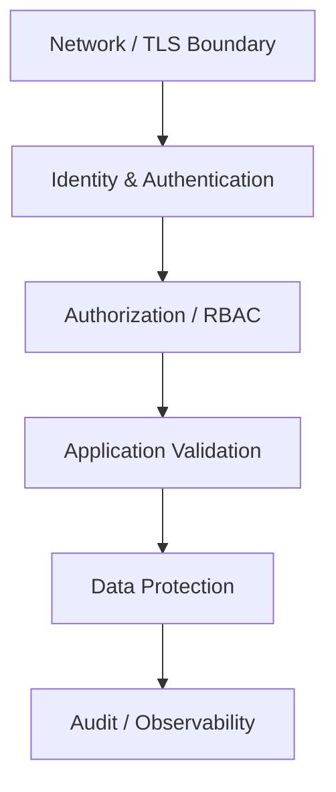
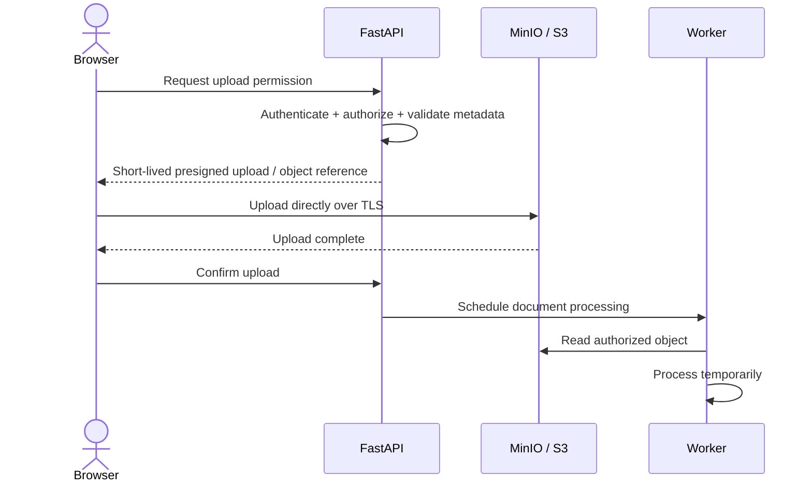

# Security & Privacy

Visa-readiness software can process extremely sensitive personal data. Security therefore cannot be reduced to "use HTTPS" or "add authentication". The architecture must control **who can access documents, where raw files are stored, how long they are retained, what reaches the AI layer, and how derived data is audited and deleted**.

## 1. Data classification

The final project presentation separates data into sensitivity tiers. A practical production interpretation is:

| Tier | Example data | Minimum controls |
|---|---|---|
| Critical | passport scans, national IDs | strict RBAC, strong encryption at rest, TLS, audit logging, retention/deletion controls, highly restricted AI exposure |
| High | bank statements, pay slips | encryption at rest + transit, strict access controls, short-lived access links |
| Medium | invitation letters, study plans | encrypted storage, authenticated access, retention policy |
| Low | public visa rules, plugin metadata | integrity, provenance, freshness, normal application authorization |

The exact classification policy should be formally approved before production deployment.

## 2. Defense in depth



### Network

- TLS for all browser/API/object-store traffic;
- reverse proxy termination with secure headers;
- private service networks where possible;
- VPN/private connectivity for hybrid deployments.

### Identity

The future-state architecture discusses OAuth2/OIDC and managed identity. For the localized MVP, the portfolio does not claim a production managed-identity deployment.

Regardless of provider, production requirements include:

- short-lived access tokens;
- secure refresh flow;
- MFA for privileged/admin roles;
- session revocation;
- no credentials embedded in source code.

### Authorization

Authentication answers *who are you?* Authorization answers *can you access this applicant/project/document?*

Every document and project query should be scoped to the authenticated principal. Object keys must not become authorization mechanisms by themselves.

Roles may include:

```text
Applicant
Partner / Agency
Admin / Reviewer
System Worker
```

A partner should not automatically receive access to every applicant's raw documents merely because a plugin was used.

## 3. Secure upload pattern

The final presentation shows a direct/presigned upload model:



Benefits:

- large document bytes do not have to traverse the API process;
- upload authorization can expire quickly;
- application API remains focused on metadata and workflow;
- storage policies can independently enforce encryption and access.

## 4. File-upload controls

Before a document is accepted for processing:

- enforce maximum file size;
- validate actual MIME/type rather than trusting filename extension;
- reject executable/archive formats unless explicitly required;
- generate server-side object identifiers;
- malware scan where appropriate;
- never render untrusted uploaded HTML/SVG directly in an admin browser;
- record checksum for integrity and idempotency.

## 5. Encryption

### In transit

- HTTPS/TLS for client traffic;
- TLS for storage and managed-service calls;
- private/VPN path for hybrid connectivity where applicable.

### At rest

- object-store encryption;
- encrypted database volumes/storage;
- tighter key strategy for the most sensitive documents where required;
- encrypted backups with independent access controls.

The future architecture mentions S3 SSE-S3 / SSE-KMS and potentially column-level database encryption. These are **target controls**, not proof of completed prototype deployment.

## 6. AI privacy boundary

A production AI pipeline should minimize the amount of PII sent to a model.

Recommended pattern:

1. extract only fields/chunks needed for the current task;
2. redact or pseudonymize where possible;
3. send only minimum context;
4. avoid using applicant documents for model training by default;
5. log model invocation metadata without copying raw passport/bank-statement content into logs;
6. support deletion of derived embeddings and analysis artifacts when source data is deleted.

## 7. Prompt injection and retrieved content

Documents and web pages are **untrusted input** even when they are used as RAG context.

Controls should include:

- separate system instructions from retrieved text;
- treat document text as data, not executable instructions;
- limit tool/function permissions available to the model;
- validate structured model output against schemas;
- never let retrieved text directly decide authorization or storage keys;
- retain provenance so reviewers can trace why a recommendation was produced.

## 8. Official-source freshness

Visa rules are time-sensitive. A correct answer last month can become incorrect today.

Each knowledge record should preserve:

- source URL;
- source type / authority;
- retrieval timestamp;
- last verification timestamp;
- country / visa type;
- version/hash;
- status: current, stale, superseded.

AI-generated text without provenance should not be treated as authoritative policy.

## 9. Logging policy

Never log:

- passport numbers;
- full national ID numbers;
- bank account details;
- full document contents;
- access tokens / refresh tokens;
- presigned URLs;
- passwords or API keys.

Prefer opaque IDs:

```text
document_id=doc_123
project_id=project_456
job_id=job_789
```

with role-aware access to the actual data.

## 10. Retention & deletion

A production policy must answer:

- how long raw documents are retained;
- when derived OCR text is deleted;
- whether embeddings are deleted with the source document;
- backup retention;
- legal/compliance requirements by geography;
- how a user requests deletion;
- whether partner analytics are aggregated/anonymized.

The original architecture documentation explicitly identifies retention and privacy compliance as unresolved production concerns; this portfolio preserves that limitation.

## 11. Test fixtures

The original team repository includes prepared documents under its test fixtures. Portfolio and CI tests should use **synthetic / intentionally prepared fixtures only**. Real applicant documents should never be committed to Git history.

See [SOURCE_EVIDENCE.md](./SOURCE_EVIDENCE.md) for the fixture location.

## 12. Secrets policy for this portfolio

This personal repository must not contain:

- real credentials;
- real applicant documents;
- private API tokens;
- internal-only infrastructure addresses unless already intentionally public and non-sensitive;
- production presigned URLs;
- raw confidential logs.

See `.gitignore` and [LIMITATIONS.md](./LIMITATIONS.md).
