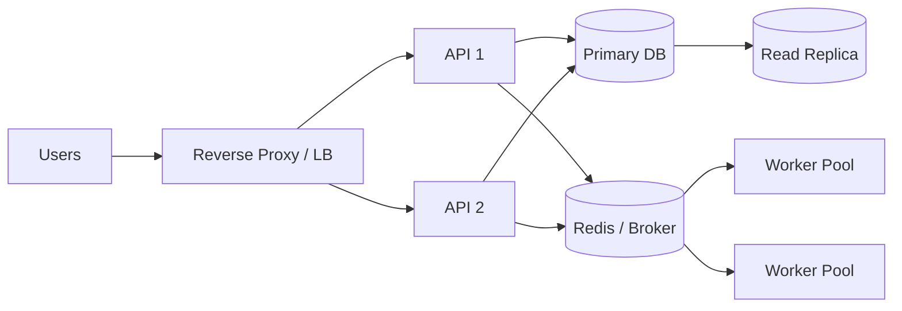

# Deployment Roadmap

The final presentation separates the architecture into three maturity stages. This is useful because it prevents an MVP from being judged as if it already required enterprise infrastructure.

## Phase 1 - localized prototype

**Goal:** prove the product flow and integration.

```text
Single VPS
└── Docker Compose
    ├── Next.js
    ├── FastAPI
    ├── PostgreSQL
    ├── Redis
    ├── Celery workers
    ├── MinIO
    ├── Ollama
    └── SearXNG / retrieval components
```

### Benefits

- low infrastructure cost;
- fast iteration;
- reproducible setup;
- local/private inference for prototype work;
- easier debugging across the whole stack.

### Limits

- host is a major failure domain;
- limited horizontal scaling;
- limited storage durability;
- queue/database/storage share infrastructure risk;
- operational maintenance remains manual.

## Phase 2 - scale & high availability

**Goal:** remove the most obvious single points of failure and scale workloads independently.

Potential steps shown or implied by the team's roadmap:

- Traefik/Nginx reverse proxy or load balancer;
- multiple stateless FastAPI instances;
- dedicated Celery worker pools;
- Redis resilience/HA;
- PostgreSQL read replica;
- automated database failover design (for example Patroni-style orchestration);
- more durable/replicated object storage;
- formal retry/DLQ handling;
- better observability.



## Phase 3 - enterprise cloud-native direction

**Goal:** use managed services for durability, scale, identity, and operational simplicity.

The architecture materials discuss services such as:

- AWS Cognito for managed identity;
- S3 for durable object storage;
- SNS/SQS/Lambda for event-driven processing;
- Amazon Bedrock / managed RAG services;
- managed database deployment with multi-AZ behavior;
- CloudWatch for cloud telemetry;
- CDN/global-delivery components.

These are **future-state architecture elements**, not claims about the localized MVP.

## Migration principles

### Keep domain APIs stable

Infrastructure can change without rewriting product semantics if modules communicate through clear interfaces.

Example:

```text
ObjectStorage interface
  local: MinIO
  cloud: Amazon S3

LLMProvider interface
  local: Ollama
  cloud: Bedrock / another provider

SearchProvider interface
  local: SearXNG
  cloud: managed/search API
```

### Migrate by measured bottleneck

Do not move everything to managed services at once. Useful triggers include:

- API saturation;
- worker queue delays;
- storage durability requirements;
- database availability requirements;
- LLM compute constraints;
- geographic latency;
- compliance requirements.

### Preserve portability

Configuration should be environment-driven. Secrets belong in secret stores/env injection, not source control. Application logic should depend on interfaces rather than provider-specific APIs where practical.

## Deployment evidence boundary

The team presentation visually distinguishes these three phases. This portfolio keeps the same boundary so recruiters can see both practical MVP delivery and forward-looking architecture without confusing the two.
