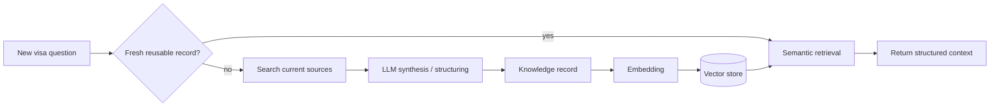

# Knowledge-Cache Flywheel

The final presentation describes a central scalability idea: **expensive research should become reusable structured knowledge instead of being repeated for every applicant**.

## Core loop



## First query

A cache miss can require:

1. identifying the country / visa type / applicant scenario;
2. retrieving official or trusted source material;
3. extracting relevant requirements;
4. structuring the result;
5. retaining provenance and timestamps;
6. embedding the record for semantic retrieval.

This is slower and more expensive, but it creates an asset that can be reused.

## Subsequent similar queries

Instead of repeating search + synthesis from scratch, the platform can:

1. embed the incoming query/context;
2. find semantically similar verified records;
3. check freshness/status;
4. reuse the structured record when appropriate;
5. refresh only when the record is stale or the scenario materially differs.

## Suggested record schema

```json
{
  "country": "example-country",
  "visa_type": "example-visa",
  "applicant_profile": {
    "nationality": "...",
    "purpose": "..."
  },
  "requirements": [],
  "source_urls": [],
  "retrieved_at": "timestamp",
  "last_verified_at": "timestamp",
  "source_hash": "...",
  "status": "active",
  "embedding_version": "v1"
}
```

## Why this is not just a normal response cache

A normal cache maps a key to a previously computed response. The project concept is closer to a **knowledge cache**:

- records are structured;
- records have source provenance;
- similarity retrieval can reuse them across non-identical queries;
- freshness matters more than a simple TTL;
- multiple applicant requests can consume the same public-rule knowledge while keeping private applicant data separate.

## Privacy boundary

Public visa-rule knowledge and private applicant data should not be mixed into one shared semantic record.

Recommended separation:

```text
Shared knowledge index
  - public / partner visa rules
  - source provenance
  - no applicant PII

Applicant/project index or context
  - extracted private document data
  - access-controlled by project/user
  - deletion follows user/document lifecycle
```

## Freshness strategy

Visa rules change. A low-latency answer is harmful if the cached rule is obsolete.

Possible invalidation signals:

- maximum verification age;
- source page changed;
- partner plugin revision;
- admin marks record stale;
- policy-change alert;
- source becomes unavailable;
- model/extraction schema changes.

## Metrics

Useful metrics include:

- semantic-cache hit ratio;
- percentage of records currently stale;
- average source age;
- refresh latency;
- refresh failure rate;
- search/LLM work avoided;
- number of requests served from verified knowledge;
- unsupported/no-source response rate.

## Failure mode to avoid

> "The vector search returned something similar, therefore it must be correct."

Semantic similarity is only a retrieval hint. Before a record is reused, the system must still match key constraints such as country, visa type, applicant context, validity date, and source authority.

## Production direction

The final deck mentions ChromaDB / pgvector-style embedding storage for the localized concept and a managed RAG/knowledge-base direction for an enterprise deployment. The portfolio treats these as interchangeable implementation strategies around the same logical capability: **versioned, source-aware, semantically retrievable knowledge**.
