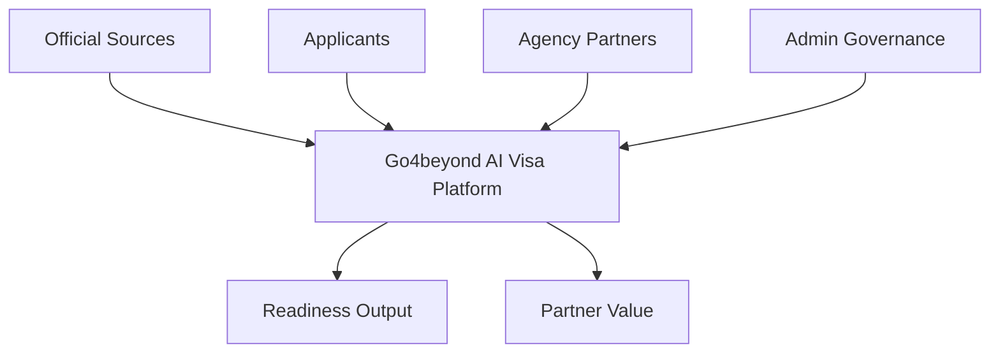

# Service Ecosystem

Go4beyond is designed as a platform connecting multiple actors rather than as a standalone chatbot.

## Actors



## Applicants

### Inputs

- destination / visa intent;
- applicant profile context;
- supporting documents;
- questions about requirements and readiness.

### Outputs

- checklist;
- structured corrections;
- readiness feedback;
- document gaps;
- contextual explanations;
- submission-preparation confidence, not an approval guarantee.

## Agency partners

The project introduces a partner-plugin model where agencies can contribute machine-readable workflow knowledge such as:

- required-document checklists;
- country/visa-specific criteria;
- validation rules;
- domain guidance.

Potential partner value described by the team includes qualified leads, visibility, and analytics.

### Governance requirement

Partner knowledge should not become trusted automatically. A production workflow should include:

```text
draft → review → approved → published → superseded/suspended
```

with audit history and versioning.

## Admin governance

Admin responsibilities include:

- approving/rejecting partner plugins;
- publishing/suspending knowledge packages;
- moderating platform integrity;
- reviewing stale or disputed criteria;
- managing operational policy.

## Official sources

Government/embassy/policy sources provide the strongest grounding layer for public requirements.

The system should preserve:

- URL/source identity;
- retrieval time;
- source version/hash;
- which structured rules came from which source;
- whether a rule was directly sourced or partner-supplied.

## Platform responsibilities

Go4beyond coordinates:

- identity;
- document storage;
- applicant/project state;
- partner criteria;
- retrieval/search;
- AI assistance;
- document processing;
- readiness analysis;
- operational governance.

## Scope boundary

The platform does **not** replace visa authorities. It standardizes readiness workflows and assists applicants before official submission.

## Why the ecosystem matters technically

Different actors require different access boundaries:

| Actor | Access boundary |
|---|---|
| Applicant | own projects/documents/results |
| Partner | own plugin drafts + explicitly authorized applicant interactions |
| Admin | governance metadata; critical document access only where operationally justified |
| Worker | narrowly scoped service access to a job/object |
| Official-source ingestion | public-source content only |

This makes authorization and audit design part of the product architecture, not only a UI concern.
